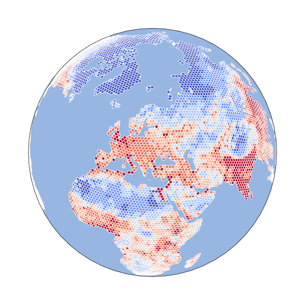

# DGGRIDRunners.jl

A Julia wrapper for the [DGGRID](https://discreteglobalgrids.org/) CLI tool,
providing high-level functions to create and query Discrete Global Grid Systems (DGGS).

[DGGRID](https://www.discreteglobalgrids.org/software/) is a free software program for creating and manipulating Discrete Global Grids created and maintained by Kevin Sahr.

- [DGGRID Version 8.43 on GitHub](https://github.com/sahrk/DGGRID)
- [DGGRID User Manual](https://github.com/sahrk/DGGRID/blob/master/dggridManualV841.pdf)

[](https://twitter.com/allixender/status/1324055326111485959)


## Installation

```julia
using Pkg
Pkg.add("DGGRIDRunners")
```

## Quick Start

```julia
using DGGRIDRunners

# Generate an ISEA7H grid at resolution 3 (whole earth)
success, params, output_path = prep_generate_grid_whole_earth("ISEA7H", 3)
run_dggrid_simple(params)
# → output_path now points to a GeoPackage with the grid cells
```

## Output and logging

DGGRIDRunners uses Julia's standard `Logging` infrastructure. By default the
library is **silent** — no output is printed during normal operation.

Validation warnings (missing files, invalid parameters) are emitted at the
`Warn` level and will show up in the default logger.

To enable verbose output (metafile paths, DGGRID command, raw DGGRID stdout)
set the `JULIA_DEBUG` environment variable before starting Julia:

```bash
JULIA_DEBUG=DGGRIDRunners julia --project=@. myscript.jl
```

or at runtime:

```julia
ENV["JULIA_DEBUG"] = "DGGRIDRunners"
```

To suppress all output including warnings, use `NullLogger`:

```julia
using Logging

with_logger(NullLogger()) do
    run_dggrid_simple(params)
end
```

To redirect output to a file:

```julia
using Logging

open("dggrid_run.log", "w") do io
    with_logger(SimpleLogger(io)) do
        run_dggrid_simple(params)
    end
end
```

## Inspiration

There is a very similar Python package with a longer history: [dggrid4py](https://github.com/allixender/dggrid4py). That package tries to abstract away the DGGRID parameters in order to give users an easier API. This [DggridRunner](https://github.com/allixender/DggridRunner.jl) Julia package goes down a different road and rather gives an easy access to better use the specific paramters for more fine-grained DGGRID usage.
